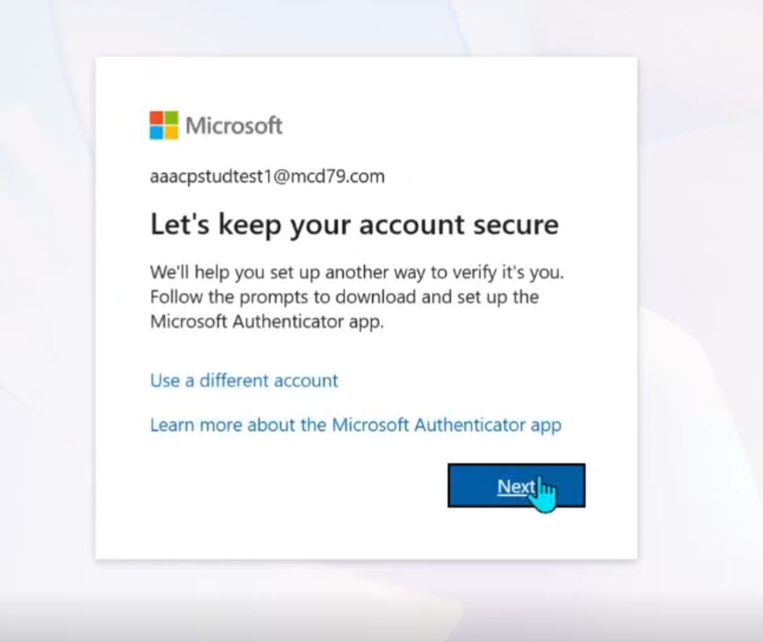
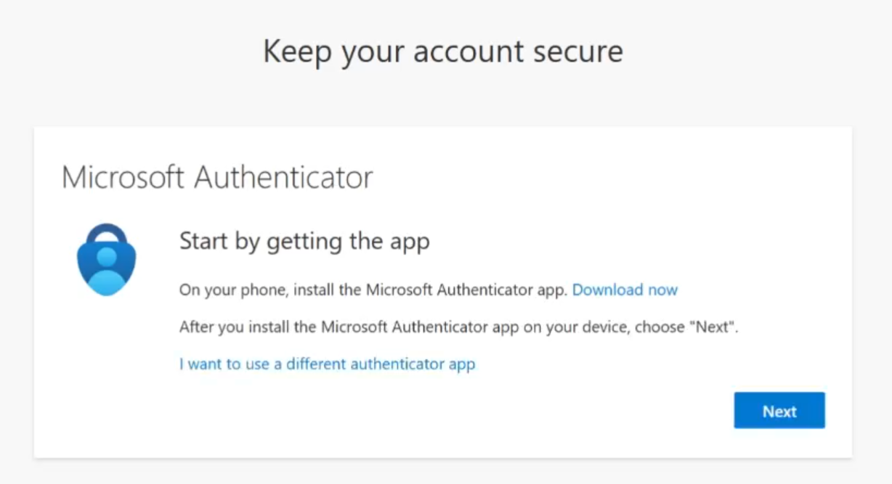
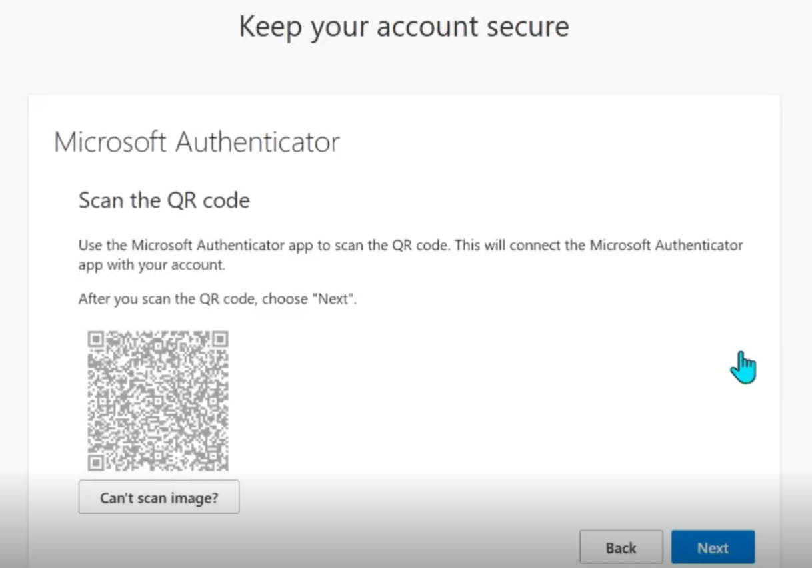
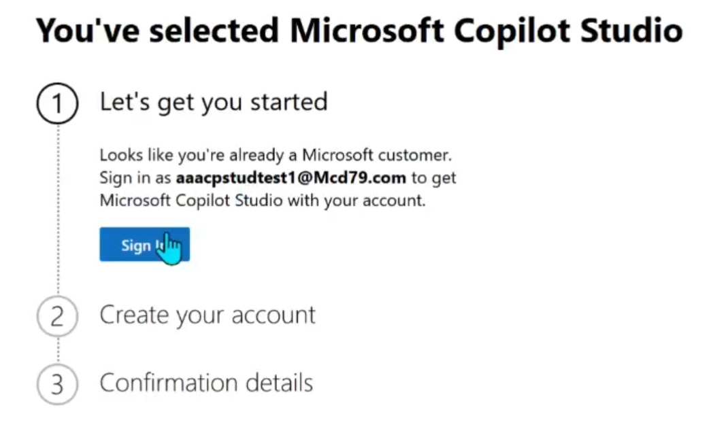
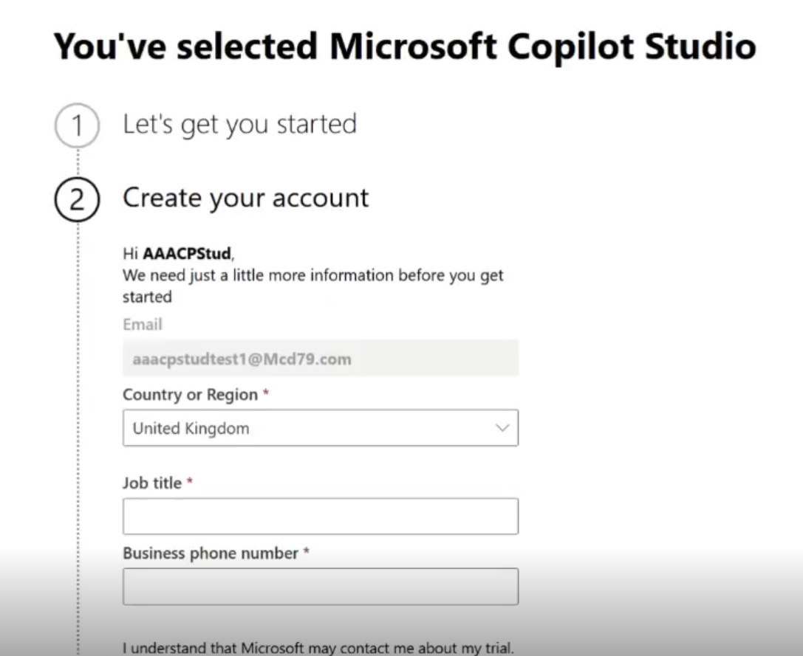
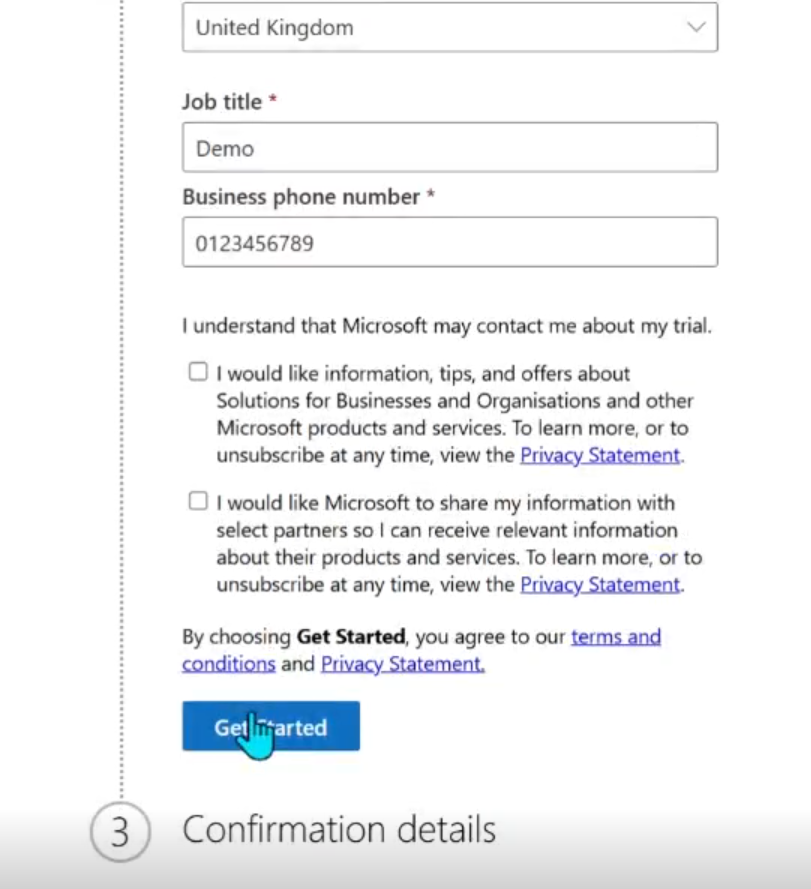

---
next:
  text: 'Building an agent'
  link: '/02 building/'
---
# Setting up environment

## Prerequisites

- Install Microsoft Authenticator on your phone
[Download authenticator](https://support.microsoft.com/en-us/account-billing/download-microsoft-authenticator-351498fc-850a-45da-b7b6-27e523b8702a)

## Login to Copilot Studio

1. Head to https://copilotstudio.microsoft.com
2. Login with an assigned account e.g. espcuserX@mcd79.com
3. When prompted, you will need to setup Multifactor Authentication (MFA)

4. Ensure you have Authenticator and then click on Next

5. Open the Authenticator app and click on the QR code button to the bottom right

6. Once logged in, you will need to set up the trial by clicking on Get Started

7. Fill out the details, without feeling that you need to put full details there

8. Click on Get Started and you are ready to start using Copilot Studio

Next step - [Build an agent](./02%20building.md)