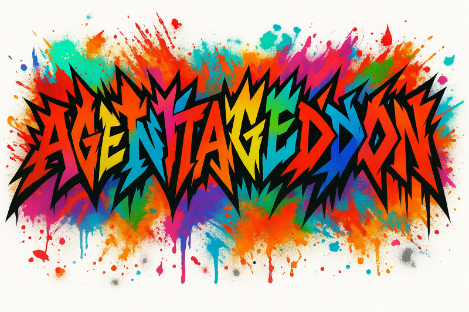

# Agentageddon

The ESPC Workshop brought to you by Zoe, Kevin and Chris

[Slide deck](https://github.com/Copilot-Connection/Agentageddon/raw/refs/heads/main/docs/assets/agentageddon.pdf)

[Knowledge sample set](https://github.com/Copilot-Connection/Agentageddon/raw/refs/heads/main/docs/assets/AgentBuildFiles.zip)

Foundry labs
[Lab 02 AI Extensibility](https://github.com/Copilot-Connection/Agentageddon/raw/refs/heads/main/docs/assets/Lab%2002%20AI%20Extensibility%20PDF.pdf)

[Lab 03 Differential AI](https://github.com/Copilot-Connection/Agentageddon/raw/refs/heads/main/docs/assets/Lab%2003%20Differential%20AI.pdf)

[Gandalf for agents]([https://www.lakera.ai/blog/guide-to-prompt-injection](https://gandalf.lakera.ai/agent-breaker) - for practicing your Red Teaming

[Guide to Prompt Injection](https://www.lakera.ai/blog/guide-to-prompt-injection)

[Video on Agent 365](https://www.youtube.com/watch?v=SlKNY0Bd7iU)
